# Libertee

Structured thinking methods as multi-agent sessions for Claude Code.

Facilitation techniques from the real world — Six Thinking Hats, Adversarial Debate, Disney Creative Strategy, Pre-Mortem Analysis, Polarity Management, TRIZ, W³, Troika Consulting, Wise Crowds, First Principles Decomposition, Analogical Transfer, Morphological Box, and Futures Cone — each powered by specialized AI agents that take on distinct roles and build on each other's insights. Plus three meta-cognitive modules that reflect on your thinking itself.

No code. No build steps. Just Markdown files that orchestrate multi-agent thinking sessions.

## Table of Contents

- [The Methods](#the-methods) — 13 structured thinking methods
- [Meta-Modules](#meta-modules) — 3 modules that think about the thinking
- [Composition](#composition) — chain methods and meta-modules
- [Features](#features) — logic modes, join mode, personas mode, brief mode, external join via Telegram
- [Installation](#installation) — GitHub or local
- [How It Works](#how-it-works) — architecture overview
- [Examples](#examples) — complete session transcripts

## The Methods

### Six Thinking Hats®

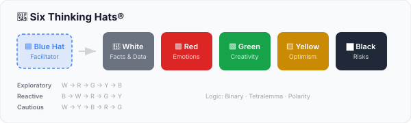

Five perspectives, one at a time. Facts first, then feelings, creativity, opportunities, and risks — in that order. The Blue Hat orchestrator chooses the sequence based on your topic (exploratory, reactive, or cautious) and synthesizes at the end. The separation is the point: mixing perspectives produces muddy thinking, separating them produces clarity.

```bash
/libertee:six-hats "Should we adopt a microservices architecture?"
```

---

### Adversarial Debate

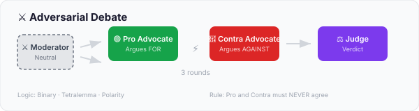

A structured 3-round debate where Pro and Contra must never agree. Each round escalates — opening statements, rebuttals, final arguments — then a Judge delivers the verdict. The agents are instructed to maintain their positions and counter every argument. This prevents the common AI pattern of politely converging and produces genuinely useful tension. Use `--personas` to cast specific figures into the roles.

```bash
/libertee:debate "Remote work is superior to office work"
/libertee:debate "Remote work is superior to office work" --personas "Sherlock Holmes, Dr. Watson"
```

---

### Disney Creative Strategy

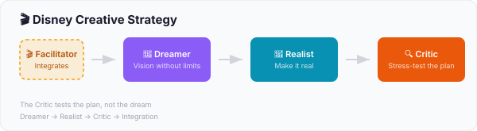

Three rooms, three mindsets. The Dreamer paints a bold vision without limits. The Realist takes that vision and builds a concrete plan — assuming it IS possible. The Critic stress-tests the plan (not the dream). Disney's genius was separating these modes into different rooms. We separate them into different agents.

```bash
/libertee:disney "What if we completely rethought our onboarding?"
```

---

### Pre-Mortem Analysis


"Imagine it failed. Spectacularly. Now tell me why." The Doom Analyst generates vivid failure scenarios, then reality-checks which ones are already showing early signs. The Facilitator turns it into a prevention plan with the uncomfortable truth nobody wants to hear. Research shows prospective hindsight increases risk identification by 30%.

```bash
/libertee:pre-mortem "We're launching a new product in Q3"
```

---

### Polarity Management®

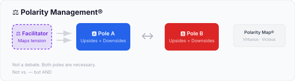

Not every tension is a problem to solve. Some are polarities to manage — where both sides need each other. Two Pole Advocates each map their pole's upsides AND downsides honestly. The Facilitator synthesizes into a Polarity Map with virtuous cycles, vicious cycles, warning signs, and action steps. Nobody wins. That's the point.

```bash
/libertee:polarity "Centralization vs Decentralization"
```

---

### TRIZ (Liberating Structure)

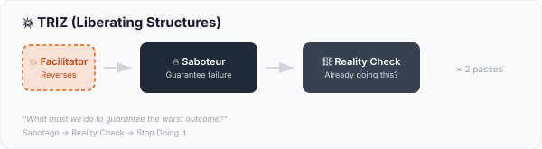

"What must we do to guarantee the worst possible outcome?" The Saboteur generates creative failure strategies with dark humor, then reality-checks which ones are already happening. Reverse brainstorming at its finest — sometimes the fastest way to improve is to stop making things worse.

```bash
/libertee:triz "Our sprint delivery reliability"
```

---

### W³ — What? So What? Now What? (Liberating Structure)

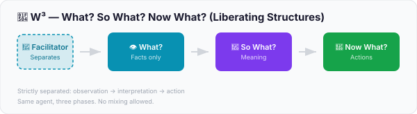

Three phases, strictly separated. First: what actually happened? (facts only, no interpretation). Then: what does it mean? (patterns and implications). Finally: what do we do now? (concrete actions). The same Reflector agent runs all three phases — the discipline is in the separation. Most teams jump straight to "Now What?" and wonder why nothing changes.

```bash
/libertee:w3 "Our last product launch"
```

---

### Troika Consulting (Liberating Structure)

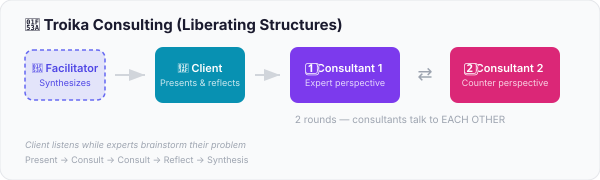

A Client presents a problem, then two Consultants brainstorm openly while the Client listens in silence. Two rounds of back-and-forth between complementary experts who talk to each other, not to you. The power is in the listening: hearing experts discuss YOUR problem without the temptation to defend, explain, or redirect. By default, all three roles are AI agents — use `--join` to take a seat, or `--personas` to name specific figures as your consultants.

```bash
/libertee:troika "We keep missing deadlines despite good planning"
/libertee:troika "We can't decide on our tech stack" --personas "Linus Torvalds, Jeff Bezos"
```

---

### Wise Crowds (Liberating Structure)

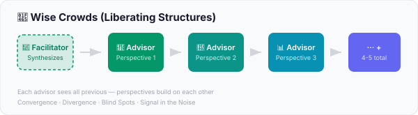

4-5 diverse stakeholder perspectives, each seeing all previous contributions. The crowd's value isn't in consensus — it's in the spread. Where they converge reveals what's real. Where they diverge reveals what's interesting. What nobody mentions reveals the blind spot. The Facilitator's synthesis maps convergence, divergence, blind spots, and the signal in the noise. Use `--personas` to populate the crowd with specific figures rather than auto-selected stakeholders.

```bash
/libertee:wise-crowds "Should we open-source our internal tooling?"
/libertee:wise-crowds "The team lacks trust" --personas "Machiavelli, Adam Smith, Brené Brown, Sun Tzu"
```

---

### First Principles Decomposition

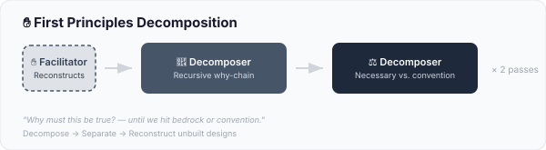

Take a claim seriously enough to dismantle it. The Decomposer asks "why?" recursively, 3-4 levels deep, naming the hidden assumptions at each level. Then sorts every assumption into physical necessity, logical necessity, convention, or untested assumption. The Facilitator reconstructs — what must stay, what can go, and the alternative designs that become possible when the conventions fall away. Most "requirements" are inherited beliefs in the costume of necessity. This is the disciplined process for taking the costume off.

```bash
/libertee:first-principles "We need a weekly status meeting"
/libertee:first-principles "Open offices are better for collaboration" --polarity
```

---

### Analogical Transfer

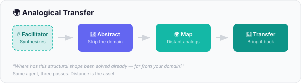

Most "creative" thinking stays inside the user's domain. Analogical Transfer is the only method that systematically forces the look outward. The Cross-Domain Analyst strips the problem to its abstract structural shape, finds at least 3 distant domains where that same shape has been solved (biology, military history, music, logistics, games, ecology), extracts the operating principles, and tests which transfer back. "Where the analogy breaks" is treated as part of the value, not a flaw. Inspired by Biomimicry and Koestler's Bisoziation.

```bash
/libertee:analogical-transfer "How do we improve knowledge transfer between teams?"
/libertee:analogical-transfer "How do we coordinate across timezones without meetings?" --polarity
```

---

### Morphological Box

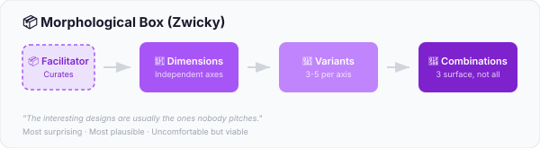

Combinatorial generation as method, not as enumeration. Fritz Zwicky's 1948 technique: decompose the design into 3-6 truly independent dimensions, list 3-5 variants per dimension (from conservative to provocative), then surface exactly 3 combinations from the full N×M×... space — most surprising, most plausible, uncomfortable but viable. The interesting designs are usually the ones nobody pitches. The "uncomfortable but viable" combination is the test: if the team can dismiss it without examining it, the method didn't push hard enough.

```bash
/libertee:morphological-box "How could a new onboarding format look?"
/libertee:morphological-box "How do we restructure our hiring process?" --polarity
```

---

### Futures Cone

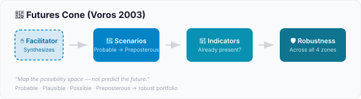

Map the future as a possibility space, not a single trajectory. The Scenario Cartographer generates four scenarios across the cone — probable (trends extrapolated), plausible (with shifts), possible (under different assumptions), preposterous (edge of imagination, but not impossible) — then identifies present-day indicators that show which futures are gaining ground, then evaluates which decisions are robust across all four zones. The discipline is taking the preposterous zone seriously and refusing to recommend a single bet. The output is a portfolio of choices that survive the space, plus the indicators worth watching, plus the brittle defaults the team is currently relying on.

```bash
/libertee:futures-cone "How will knowledge work look in 5 years?"
/libertee:futures-cone "Will our industry consolidate or fragment?" --polarity
```

---

## Meta-Modules

Methods think about content. Meta-Modules think about the thinking.

Three meta-cognitive checks you can run after any method — they read the session context and reflect on what shaped the result, not the result itself.

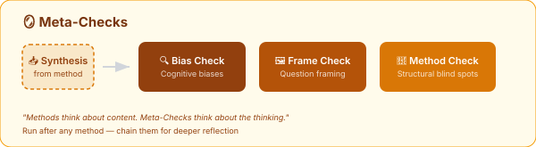

### Bias Check

What cognitive biases make you trust the result too easily? Maps 3-4 biases to concrete moments in the session, then asks one uncomfortable question that challenges the conclusion.

```bash
/libertee:six-hats "Should we restructure?" --brief
/libertee:bias-check
```

### Frame Check

How did the way you phrased the question predetermine the answer space? Identifies framing effects in the original question and offers one reframe that opens up what the original wording closed off.

```bash
/libertee:debate "Build vs. buy for our platform"
/libertee:frame-check
```

### Method Check

What can the method you just used structurally not see? Every method has a shape — and that shape has blind spots. Identifies structural limits and suggests one complementary method to cover the gap.

```bash
/libertee:pre-mortem "Platform migration"
/libertee:method-check
```

---

## Composition

Modules can be chained. Run a method, then reflect on it.

```bash
# Decision quality: explore → stress-test → check your biases
/libertee:six-hats "New pricing model" --brief
/libertee:debate "The leading option from Six Hats"
/libertee:bias-check

# Innovation with guard rails: dream → anticipate failure → check the frame
/libertee:disney "Rethink onboarding"
/libertee:pre-mortem "The plan from Disney"
/libertee:frame-check

# Full meta-reflection after any method
/libertee:wise-crowds "Open-source strategy"
/libertee:bias-check
/libertee:frame-check
/libertee:method-check
```

Inspired by [Liberating Structure Strings](https://www.liberatingstructures.com/sample-strings/) — the idea that individual structures become more powerful when composed into sequences.

---

## Features

### Logic Modes

All methods support alternative evaluation logic:

| Mode | What it does | Flag |
|------|-------------|------|
| **Binary** | Pick a side (default) | — |
| **Tetralemma** | The one, the other, both, neither, or wrong question | `--tetralemma` |
| **Polarity** | Map the tension, don't resolve it | `--polarity` |

```bash
/libertee:debate "Build vs. buy" --tetralemma
```

### Join Mode

Take on a role yourself — bring your real emotions, domain knowledge, or conviction:

```bash
/libertee:six-hats "Team restructuring" --join red        # Your real feelings
/libertee:debate "Switch to Kubernetes" --join pro         # You argue, AI counters
/libertee:disney "New onboarding" --join dreamer           # Your vision
/libertee:pre-mortem "Platform migration" --join doom      # You know where it hurts
/libertee:polarity "Autonomy vs Alignment" --join a        # Your bias, made visible
/libertee:triz "Sprint reliability" --join saboteur        # Your insider sabotage knowledge
/libertee:w3 "Last quarter" --join so-what                 # Your interpretation
/libertee:troika "Missed deadlines" --join client          # Your real problem, AI consults
/libertee:wise-crowds "Open-source strategy" --join CTO    # Your seat at the table
```

### Personas Mode

Three methods support `--personas` to replace auto-selected perspectives with specific named figures — historical persons, fictional characters, or anyone with a recognizable voice and reasoning style:

```bash
/libertee:wise-crowds "The team lacks trust" --personas "Machiavelli, Adam Smith, Brené Brown, Sun Tzu"
/libertee:troika "We can't decide on our tech stack" --personas "Linus Torvalds, Jeff Bezos"
/libertee:debate "Remote work is better than office" --personas "Sherlock Holmes, Dr. Watson"
```

The method logic stays unchanged — personas shape the voice and reasoning style, not the structure. Holmes still argues pro, Watson contra; Torvalds and Bezos still run two rounds of consultation. The facilitator adds a 1-sentence framing for each persona before spawning, so the agents adopt the character with context, not just a name.

Combine with `--join` for hybrid sessions:

```bash
/libertee:debate "AI will replace developers" --join pro --personas "Turing, Dijkstra"
# You argue as Turing (Pro), AI plays Dijkstra (Contra)
```

Personas work for any figure with a recognizable perspective: scientists, philosophers, historical leaders, fictional characters, archetypes.

### External Join via Telegram

An external participant joins a session via Telegram — no Claude Code required on their end.

**One-time setup (facilitator):**
```bash
# Create a bot first: Telegram → @BotFather → /newbot
bash scripts/setup-telegram.sh
```

`CHAT_ID` is optional — if not stored, the session bootstraps dynamically: Claude prompts you to share the bot link, waits for the participant's first message, and continues from there.

**Usage:**
```bash
/libertee:debate "Remote work is better than office" --join contra --telegram
# → Contra's turns go to Telegram; participant sends a normal message; session continues

/libertee:troika "We keep missing deadlines" --join client --telegram
# → Client's problem presentation and reflection come from Telegram

/libertee:wise-crowds "Should we open-source our tooling?" --join CTO --telegram 987654321
# → CTO perspective comes from that specific chat_id
```

`--telegram` — uses default `CHAT_ID` from config
`--telegram 987654321` — specific chat ID (multiple contacts)
`--telegram new` — bootstrap dynamically, even if a default is configured

### Brief Mode

All methods support `--brief` for tighter output — same structure, same perspectives, fewer words. Ideal for mobile or when you need a quick pulse rather than a deep dive.

```bash
/libertee:six-hats "Team restructuring" --brief
/libertee:troika "Scaling challenges" --brief --join client
```

### Session Context

Libertee picks up what you discussed before the command. Had a 20-minute conversation about technical debt? `/libertee:pre-mortem` will generate failure scenarios grounded in that context. Want a clean slate? `/clear` first.

### Guide

Not sure which method to use?

```bash
/libertee:guide "I need to make a tough decision about our tech stack"
```

Works in any language — agents automatically respond in yours.

## Installation

### From GitHub (permanent)

```bash
# Add the marketplace (once)
/plugin marketplace add worksystems-design/libertee

# Install
/plugin install libertee@worksystems-design-libertee
```

Restart Claude Code after installation (`/exit`, then relaunch).

### Try it locally (session only)

```bash
git clone https://github.com/worksystems-design/libertee.git
claude --plugin-dir ./libertee
```

### Uninstall

```bash
/plugin uninstall libertee@worksystems-design-libertee
```

## How It Works

Each method follows the same architecture:

1. **You** provide a topic, thesis, or challenge
2. **The orchestrator** detects your language, picks up session context, and spawns agents one by one
3. **Each agent** receives all previous perspectives as accumulated context, then adds their own
4. **The orchestrator** synthesizes everything at the end — never before all perspectives are in

Agents are temporary — they exist only during their turn, deliver their perspective, and are done. The sequential accumulation is the method: each perspective gets richer because it sees everything that came before.

## Examples

Complete example sessions (all in `--brief` mode) in English and German:

- Six Thinking Hats® — [English](examples/en/six-hats.md) · [Deutsch](examples/de/six-hats.md)
- Adversarial Debate — [English](examples/en/debate.md) · [Deutsch](examples/de/debate.md)
- Disney Creative Strategy — [English](examples/en/disney.md) · [Deutsch](examples/de/disney.md)
- Pre-Mortem — [English](examples/en/pre-mortem.md) · [Deutsch](examples/de/pre-mortem.md)
- Polarity Management® — [English](examples/en/polarity.md) · [Deutsch](examples/de/polarity.md)
- TRIZ — [English](examples/en/triz.md) · [Deutsch](examples/de/triz.md)
- W³ — [English](examples/en/w3.md) · [Deutsch](examples/de/w3.md)
- Troika Consulting — [English](examples/en/troika.md) · [Deutsch](examples/de/troika.md)
- Wise Crowds — [English](examples/en/wise-crowds.md) · [Deutsch](examples/de/wise-crowds.md)

**Meta-Modules** (chained after a method):

- Bias Check (after Six Hats) — [English](examples/en/bias-check.md) · [Deutsch](examples/de/bias-check.md)
- Frame Check (after Debate) — [English](examples/en/frame-check.md) · [Deutsch](examples/de/frame-check.md)
- Method Check (after Pre-Mortem) — [English](examples/en/method-check.md) · [Deutsch](examples/de/method-check.md)

## Community

Questions, ideas, or just want to see what others are doing with Libertee?

→ [Join the Discord](https://discord.gg/VhZeW3aJ5r)

## Contributing

See [CONTRIBUTING.md](CONTRIBUTING.md) for guidelines on adding new thinking methods.

## License

MIT — see [LICENSE](LICENSE)

## Trademark Notice

Methods in this plugin are referenced for educational and descriptive purposes. This plugin is not affiliated with, endorsed by, or sponsored by any of the organizations below.

- **Six Thinking Hats®** is a registered trademark of Edward de Bono Ltd.
- **Polarity Management®** and **Polarity Map®** are registered trademarks of Barry Johnson & Polarity Partnerships, LLC.
- **Disney Creative Strategy** was formalized by Robert Dilts (1994), based on Walt Disney's creative process.
- **Pre-Mortem Analysis** is a technique developed by Gary Klein.
- **Tetralemma** is rooted in Indian logic, formalized for systemic work by Matthias Varga von Kibed and Insa Sparrer.
- **Adversarial Debate** draws on multi-agent debate research (MIT CSAIL, Mitsubishi Electric).
- **TRIZ**, **W³ (What? So What? Now What?)**, **Troika Consulting**, and **Wise Crowds** are [Liberating Structures](https://www.liberatingstructures.com/) developed by Henri Lipmanowicz and Keith McCandless.
- **Bias Check** draws on cognitive bias research by Daniel Kahneman (*Thinking, Fast and Slow*, 2011).
- **Composition** of modules is inspired by [Liberating Structure Strings](https://www.liberatingstructures.com/sample-strings/).

## Author

Thomas Krause — [worksystems.design](https://worksystems.design)
